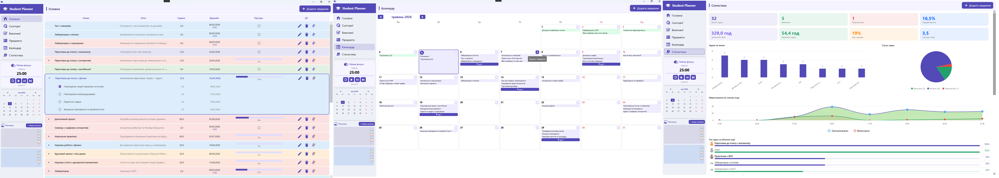
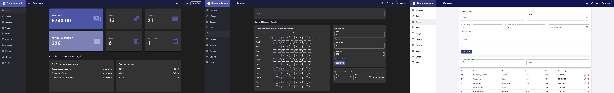

<h1 align="left">Hi, I'm Valeria 👋</h1>

4th-year Computer Engineering student at **Kryvyi Rih National University**.
I build desktop applications with **C#** and **.NET** — focused on clean architecture,
multithreading, and real-world usability.

🎯 Looking for my first **junior developer** role.

---

<h2 align="left">🛠 Tech Stack</h2>

<table align="center">
  <tr>
    <th align="center">💻 Languages &amp; Platform</th>
    <th align="center">🗄️ Data</th>
    <th align="center">🧰 Tools</th>
  </tr>
  <tr>
    <td align="center" valign="middle">
      
    </td>
    <td align="center" valign="middle">
      
    </td>
    <td align="center" valign="middle">
      
    </td>
  </tr>
</table>

  
  
  
  

---

<h2 align="left">🔨 Featured Project</h2>

### [MultiThreaded Study Planner](https://github.com/ValeriaKarpachova/MultiThreadedStudyPlanner)

> A desktop app for managing student workload.

  

- 📅 Task scheduling and deadline analysis
- 🧮 Automatic priority calculation
- ⏱️ Pomodoro timer and background monitoring

**Built with:**

  
  
  
  
  
  

---

<h2 align="left">🚧 In Progress</h2>

### [CinemaSystem](https://github.com/ValeriaKarpachova/CinemaSystem) &nbsp;

> A cinema booking platform — built to explore server-side Blazor and real-time features.

  

- 🛠️ Admin panel — full CRUD, auto seat-grid generation, schedule conflict detection
- 🔎 Search & filtering — movies, sessions, tickets, all at the query level (LINQ)
- 📊 Analytics — revenue, occupancy, daily totals via hand-written SQL (Dapper, window functions)
- 🎟️ Customer booking (in progress) — interactive seat map, real-time locking via SignalR, no double-booking

  
  
  
  
  
  
  

---

<h2 align="left">📚 Currently Learning</h2>

- **Entity Framework Core** — ORM for .NET, natural next step after raw SQLite
- **ASP.NET Core basics** — to eventually build APIs alongside desktop clients
- **Blazor Server** — building interactive web UIs in C#
- **SignalR** — real-time communication between server and clients

---

<h2 align="left">📫 Contact</h2>

